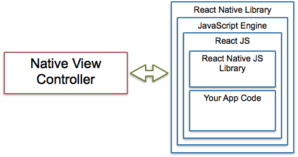

# React Native

## Aplicativos móveis nativos usando JavaScript e React

O React Native permite a criação de aplicativos móveis usando apenas JavaScript. Ele usa o mesmo design que o React, permitindo compor uma rica interface de usuário a partir de componentes declarativos.

## Um aplicativo React Native é um aplicativo móvel nativo

Com o React Native, não é criado um "aplicativo da Web para dispositivos móveis", um "aplicativo HTML5" ou um "aplicativo híbrido". Será criado um aplicativo móvel real que é indistinguível de um aplicativo criado usando o Objective-C ou o Java. O React Native usa os mesmos blocos de construção fundamentais de interface com o usuário dos aplicativos iOS e Android comuns. Esses blocos de construção são colocados juntos usando JavaScript e React.

```jsx
import React, { Component } from "react";
import { Text, View } from "react-native";

class MeuComponente extends Component {
  render() {
    return (
      <View>
        <Text>React Native é o React aplicado ao desenvolvimento mobile.</Text>
        <Text>
          São utilizados componentes nativos como 'View' e 'Text', ao invés dos
          componentes web como 'div' e 'span'.
        </Text>
      </View>
    );
  }
}
```

## Diagrama



## Recompilação mais rápida

O React Native permite que se construa um aplicativo mais rapidamente. Em vez de recompilar, pode-se recarregar o aplicativo instantaneamente. Com o Hot Reloading, pode-se até mesmo executar um novo código, mantendo o estado do aplicativo.

## Código nativo quando for necessário

React Native pode ser combinado com componentes escritos em Objective-C, Java ou Swift. É possível utilizar código nativo se for necessário otimizar alguns aspectos do aplicativo. Também é possível criar parte do aplicativo no React Native e parte usando o código nativo diretamente.
