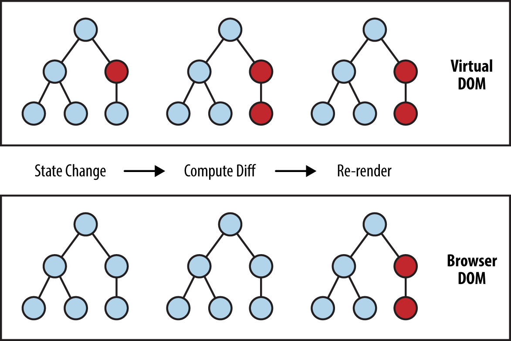

# Introdução ao React Native

## React

O React é uma biblioteca JavaScript declarativa, eficiente e flexível para criar interfaces com o usuário. Ele permite compor interfaces de usuário complexas a partir de pequenos e isolados códigos chamados "componentes":

```jsx
class ListaCompras extends React.Component {
  render() {
    return (
      <div className="lista-compras">
        <h1>Lista de Compras para: {this.props.name}</h1>
        <ul>
          <li>Instagram</li>
          <li>WhatsApp</li>
          <li>Oculus</li>
        </ul>
      </div>
    );
  }
}
```

Utiliza-se componentes para dizer ao React o que será exibido na tela. Quando os dados forem alterados, o React atualizará e renderizará novamente com eficiência os componentes.

Aqui, o `ListaCompras` é uma classe de componente React ou o tipo de componente React. Um componente recebe parâmetros, chamados `props` (abreviação de "propriedades"), e retorna uma hierarquia de componentes visuais para exibir através do método `render`.

O método `render` retorna uma descrição do que se deseja ver na tela. React pega a descrição e exibe o resultado. Em particular, `render` retorna um elemento React, que é uma descrição simples do que renderizar. A maioria dos desenvolvedores do React usa uma sintaxe especial chamada _JSX_, que facilita a gravação dessas estruturas. A sintaxe `<div/>` é transformada no momento da criação para `React.createElement('div')`. O exemplo acima é equivalente a:

```jsx
return React.createElement(
  'div',
  {className: 'lista-compras'},
  React.createElement('h1' /* ... filhos de h1 ... */),
  React.createElement('ul' /* ... filhos de ul ... */),
);
```

O JSX possui todo o poder do JavaScript. Coloca-se qualquer expressão JavaScript dentro de chaves dentro do JSX. Cada elemento React é um objeto JavaScript que se pode armazenar em uma variável ou passar ao programa.

O componente ListaCompras acima apenas renderiza componentes DOM internos, como `<div>` e `<li>`. Mas também pode compor e renderizar componentes React personalizados. Por exemplo, podemos nos referir a toda a lista de compras escrevendo `<ListaCompras/>`. Cada componente React é encapsulado e pode operar de forma independente; Isso permite que se construa interfaces com o usuário complexas a partir de componentes simples.

Podemos testar a compilação de código JSX de forma online através do link: https://babeljs.io/repl/. Insira o código abaixo:

```jsx
<div class="foo">
  <span>Teste</span>
</div>
```

## Virtual DOM

Primeiramente, DOM significa "Document Object Model". O DOM em palavras simples representa a interface do usuário do seu aplicativo. Sempre que há uma alteração no estado da interface do usuário do aplicativo, o DOM é atualizado para representar essa alteração. Agora, a dificuldade é que manipular frequentemente o DOM afeta o desempenho, tornando-o lento.

### O que torna a manipulação do DOM lenta?

O DOM é representado como uma estrutura de dados em árvore. Por esse motivo, as alterações e atualizações no DOM são rápidas. Mas após a alteração, o elemento atualizado e seus filhos precisam ser renderizados novamente para atualizar a interface do usuário do aplicativo. A nova renderização ou nova pintura da interface do usuário é o que a torna lenta. Portanto, quanto mais componentes de interface do usuário você tiver, mais caras serão as atualizações do DOM, pois elas precisarão ser renderizadas novamente para cada atualização do DOM.

### DOM virtual

É aí que o conceito de DOM virtual entra e apresenta um desempenho significativamente melhor que o DOM real. O DOM virtual é apenas uma representação virtual do DOM. Sempre que o estado de nosso aplicativo é alterado, o DOM virtual é atualizado em vez do DOM real.

Bem, você pode perguntar "O DOM virtual não está fazendo a mesma coisa que o DOM real, isso soa como um trabalho duplo? Como isso pode ser mais rápido do que apenas atualizar o DOM real?"

A resposta é que o DOM virtual é muito mais rápido e eficiente, eis o porquê.

### Como o DOM virtual é mais rápido?

Quando novos elementos são adicionados à interface do usuário, um DOM virtual, representado como uma árvore, é criado. Cada elemento é um nó nesta árvore. Se o estado de qualquer um desses elementos for alterado, uma nova árvore DOM virtual será criada. Essa árvore é então comparada ou "diferenciada" com a árvore DOM virtual anterior.

Feito isso, o DOM virtual calcula o melhor método possível para fazer essas alterações no DOM real. Isso garante que haja operações mínimas no DOM real. Portanto, reduzindo o custo de desempenho da atualização do DOM real.

A imagem abaixo mostra a árvore DOM virtual e o processo de diferenciação.



(Adaptado de: https://programmingwithmosh.com/react/react-virtual-dom-explained/)

## React Native

O React Native é uma solução multi-plataforma para escrever aplicativos móveis nativos. O Facebook abriu o código fonte do React Native em março de 2015. Eles o construíram porque, como muitas empresas, o Facebook precisava disponibilizar seus produtos na Web, bem como em várias plataformas móveis, e é difícil manter equipes especializadas necessárias para construir um mesmo app em diferentes plataformas. Depois de experimentar várias técnicas diferentes, a React Native foi a solução do Facebook para o problema.

### O que faz o React Native Diferente?

Já existem soluções para criar aplicativos para dispositivos móveis: desde escrever código nativo em linguagens proprietárias até escrever _aplicativos da Web para dispositivos móveis_ ou soluções híbridas. Então, por que os desenvolvedores precisam de outra solução? Por que eles deveriam dar uma chance ao React Native?

Ao contrário de outras opções disponíveis, o React Native permite que os desenvolvedores escrevam aplicativos nativos no iOS e no Android usando JavaScript com o React em uma única base de código. Ele usa os mesmos princípios de design usados ​​pelo React na Web e permite criar interfaces usando o modelo de componente que já é familiar aos desenvolvedores. Além disso, ao contrário de outras opções que permitem usar tecnologias da Web para criar aplicativos híbridos, o React Native é executado no dispositivo usando os mesmos blocos de construção fundamentais usados ​​pelas soluções específicas da plataforma, tornando-a uma experiência mais natural para os usuários.

(Adaptado de: http://engineering.monsanto.com/2018/01/11/react-native-intro/)

## Comparando React com React Native

### Configuração e Construção

React-Native é um framework e o ReactJS é uma biblioteca de JavaScript. Quando se inicia um novo projeto com o ReactJS, deverá ser escolhido um bundler como o Webpack que tentará descobrir quais módulos de empacotamento são necessários para o seu projeto. O React-Native vem com tudo o que se precisa. Quando se inicia um novo projeto React Native é fácil de configurar: leva apenas uma linha de comando para ser executada no terminal e está pronto para começar. Pode-se começar a codificar o primeiro aplicativo nativo imediatamente usando o ES6, alguns recursos do ES7 e até mesmo alguns polyfills.

Para executar o aplicativo, precisará ter o Xcode (para iOS, somente no Mac) ou o Android Studio (para Android) instalado em seu computador. Pode-se optar por executá-lo em um simulador/emulador da plataforma que deseja usar ou diretamente em seus próprios dispositivos.

### DOM e Estilização

O React-Native não usa HTML para renderizar o aplicativo, mas fornece componentes alternativos que funcionam de maneira semelhante. Esses componentes React-Native mapeiam os componentes reais reais da interface iOS ou Android que são renderizados no aplicativo.

A maioria dos componentes fornecidos pode ser traduzida para algo semelhante em HTML, onde, por exemplo, um componente View é semelhante a uma tag div e um componente Text é semelhante a uma tag p.

```jsx
import React, {Component} from 'react';
import {View, Text} from 'react-native';

export default class App extends Component {
  render() {
    return (
      <View style={styles.container}>
        <Text style={styles.intro}>Hello world!</Text>
      </View>
    );
  }
}
```

Para estilizar os componentes React-Native, é necessário criar folhas de estilo em JavaScript.

```jsx
const styles = StyleSheet.create({
  container: {
    flex: 1,
  },
  content: {
    backgroundColor: '#fff',
    padding: 30,
  },
  button: {
    alignSelf: 'center',
    marginTop: 20,
    width: 100,
  },
});
```

(Adaptado de: https://medium.com/@alexmngn/from-reactjs-to-react-native-what-are-the-main-differences-between-both-d6e8e88ebf24)

## Expo vs React Native CLI

Existem dois métodos para inicializar e desenvolver seu aplicativo: Expo e a CLI do React Native. Até recentemente, havia um terceiro método distinto, usando o Create React Native App (CRNA). Desde então, a CRNA foi incorporada ao projeto Expo e só continua a existir como uma entidade separada para fornecer compatibilidade com versões anteriores.

Para usuários com pouca experiência de desenvolvimento, a maneira mais fácil de começar é com o Expo CLI. O Expo é um conjunto de ferramentas criadas em torno do React Native e, embora tenha muitos recursos, o recurso mais relevante para nós no momento é que você pode escrever um aplicativo React Native em poucos minutos. Você precisará apenas de uma versão recente do Node.js e de um telefone ou emulador.

Desenvolvedores mais experientes podem usar o React Native CLI. Requer o Xcode ou o Android Studio para começar. Se você já possui uma dessas ferramentas instaladas, poderá criar uma aplicação em alguns minutos.

A Expo se enquadra na categoria de ferramentas, fornecendo um fluxo de trabalho de desenvolvimento mais robusto e amigável ao desenvolvedor, ao custo de alguma flexibilidade. Os aplicativos iniciados com a Expo também têm acesso a vários recursos úteis fornecidos pelo Expo SDK, como o BarcodeScanner, o MapView, o ImagePicker e muito mais.

A inicialização de um aplicativo com a CLI do React Native, por meio do comando react-native init fornece flexibilidade ao custo da facilidade de desenvolvimento. Diz-se que um aplicativo React Native criado com o comando react-native init é um aplicativo React Native puro, pois nenhum código nativo está oculto ao desenvolvedor.

Em nosso caso utilizaremos o React Native CLI durante nosso treinamento.
