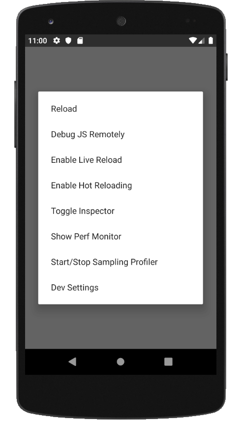

# Iniciando o Projeto

Podemos inicializar e executar nosso projeto com muita facilidade utilizando o `react-native-cli`:

```bash
> react-native init CoZooMob
```

Abra a pasta do projeto no VS Code, em seguida ative o terminal: `Terminal -> New Termial`

Divida o terminal em dois: Split Terminals

Em um terminal entre com o comando:

```bash
> react-native start
```

E no outro:

```bash
> react-native run-android
```

Obs.: O comando `react-native run-android` deve ser executado após o emulador do Android estar em execução.

A aplicação deverá ser executada no emulador conforme o print abaixo:


## Conhecendo a estrutura básica de um projeto React Native

- `__tests__`: Pasta de testes do projeto;
- `android`: Pasta do projeto nativo Android;
- `ios`: Pasta do projeto nativo iOS;
- `node_modules`: Pasta dependências JavaScript;
- `.buckconfig`: Configuração do sistema de build Buck;
- `.eslintrc.js`: Configuração do linter de código;
- `.flowconfig`: Configuração do checador de tipagem estática Flow;
- `.gitattributes`: Configurações do git;
- `.gitignore`: Configuração de arquivos ignorados pelo git;
- `.prettierrc.js`: Configuração do formatador de código Prettier;
- `.watchmanconfig`: Configuração da ferramenta de monitoração Watchman;
- `App.js`: A primeira tela (e componente) de nosso aplicativo!
- `app.json`: Algumas propriedades de nosso aplicativo;
- `babel.config.js`: Configuração do transpilador babel;
- `index.js`: Ponto de partida inicial de nossa aplicação;
- `metro.config.js`: Configuração do bundler metro;
- `package-lock.json`: Descritor da árvore de dependências completa do projeto;
- `package.json`: Descritor do projeto NPM;

## Ajustando a tela inicial

Vamos alterar o arquivo `App.js` para que tenha o seguinte conteúdo:

- `App.js`

```jsx
import React, {Component} from 'react';
import {Text, View} from 'react-native';

export default class App extends Component {
  render() {
    return (
      <View style={{flex: 1, justifyContent: 'center', alignItems: 'center'}}>
        <Text>Controle de Zoológico Mobile!</Text>
      </View>
    );
  }
}
```

Obs.: Caso ocorra um erro do tipo:

```
Error: ESLint configuration in .eslintrc.js » @react-native-community/eslint-config is invalid:
	- Property "overrides" is the wrong type (expected array but got `{"files":["**/__tests__/**/*.js","**/*.spec.js","**/*.test.js"],"env":{"jest":true,"jest/globals":true}}`).
```

Isto ocorre devido a uma incompatibilidade entre a versão mais nova do ESLint e a configuração do react (https://github.com/facebook/create-react-app/issues/7284), e pode ser resolvida através do _downgrade_ da versão do ESLint do projeto, alterando a seguinte linha no `package.json`:

```json
...
  "devDependencies": {
    "eslint": "5.16.0"
  }
...
```

Em seguida, devemos remover e reinstalar as dependências:

```bash
> rm -rf node_modules
> npm install
```

## Auto-formatação do Código

Para facilitar com que nosso time utilize o mesmo padrão de codificação, iremos configurar para que o VS Code formate automaticamente nosso código: File -> Preferences -> Settings -> User -> Format on Save: True

É necessário que os plugins ESLint e Prettier estejam instalados no VS Code.

Agora, sempre que algum arquivo for salvo, ele será automaticamente formatado.

## Conhecendo melhor o VS Code


## Conhecendo as Ferramentas de Desenvolvedor



## ES2015 (ES6) e JSX

Dois pontos importantes de serem notados é o uso de ES2015 e JSX. O ES2015 nos permite utilizar diversos recursos modernos da linguagem JavaScript que veremos no decorrer do treinamento. Já o JSX é uma extensão do JS que nos permite descrever elementos de forma similar ao XML diretamente no código de nossa aplicação, tornando a escrita de compoentes muito mais simples.

## Componentes

Componentes são a estrutura básica do React, basicamente tudo que vemos em tela são Componentes ou uma composição de diversos componentes. Criaremos muitos componentes no decorrer de nosso treinamento.

Um componente é uma classe simples, único método obrigatório de um componente é a função `render`, que define a exibição do mesmo.

## Melhorando a organização do código

Uma boa prática é já focar desde o começo de nosso projeto em sua organização. Para isso vamos mover nosso componente para uma subpasta que criaremos `src/components/App.js`.

## Exibindo algo mais interessante

Vamos começar exibindo os detalhes de um animal:

- `App.js`

```jsx
import React, {Component} from 'react';
import {Image, Text, View, Dimensions} from 'react-native';

export default class App extends Component {
  render() {
    const {width} = Dimensions.get('screen');

    return (
      <View>
        <Text style={{fontSize: 16}}>Leão</Text>
        <Image
          source={{
            uri:
              'https://upload.wikimedia.org/wikipedia/commons/4/40/Just_one_lion.jpg',
          }}
          style={{width, height: width}}
        />
      </View>
    );
  }
}
```

Repare na sintaxe de `const {width} = Dimensions.get('screen')`, esta é a chamada atribuição via desestruturação. A sintaxe de atribuição via desestruturação (destructuring assignment) é uma expressão JavaScript que possibilita extrair dados de arrays ou objetos em variáveis distintas (https://developer.mozilla.org/pt-BR/docs/Web/JavaScript/Reference/Operators/Atribuicao_via_desestruturacao)

Pensando na melhoria de código, seria mais eficiente que tivéssemos tanto as propriedades do CSS quanto os dados dos animais separados em variáveis:

- `App.js`

```jsx
const {width} = Dimensions.get('screen');

export default class App extends Component {
  render() {
    const animal = {
      nome: 'Leão',
      urlImagem:
        'https://upload.wikimedia.org/wikipedia/commons/4/40/Just_one_lion.jpg',
    };

    return (
      <View>
        <Text style={styles.nomeAnimal}>{animal.nome}</Text>
        <Image
          source={{
            uri: animal.urlImagem,
          }}
          style={styles.imagemAnimal}
        />
      </View>
    );
  }
}

const styles = StyleSheet.create({
  nomeAnimal: {fontSize: 16},
  imagemAnimal: {width, height: width},
});
```

## Vários Animais

Agora que já temos um animal sendo exibido, nosso próximo passo é passar a exibir uma lista de animais, para isso, utilizaremos um array de animais e a função `map`:

- `App.js`

```jsx
export default class App extends Component {
  render() {
    const animais = [
      {
        nome: 'Leão',
        urlImagem:
          'https://upload.wikimedia.org/wikipedia/commons/4/40/Just_one_lion.jpg',
      },
      {
        nome: 'Girafa',
        urlImagem:
          'https://upload.wikimedia.org/wikipedia/commons/9/97/Namibie_Etosha_Girafe_02.jpg',
      },
      {
        nome: 'Gato',
        urlImagem:
          'https://upload.wikimedia.org/wikipedia/commons/b/b2/WhiteCat.jpg',
      },
    ];

    return (
      <View>
        {animais.map(animal => (
          <View>
            <Text style={styles.nomeAnimal}>{animal.nome}</Text>
            <Image
              source={{
                uri: animal.urlImagem,
              }}
              style={styles.imagemAnimal}
            />
          </View>
        ))}
      </View>
    );
  }
}
```

Alguns pontos merecem destaque aqui:

- Utilizamos o método `map` do objeto array do JavaScript para iterar sobre a lista de animais, perceba que no JSX não há uma sintaxe especial de template, utilizamos as construções do próprio JavaScript;

- É necessário envolver a resposta do `map` em um elemento raiz `<View>`, tente remover este elemento e veja o que ocorre;

Mas ainda faltam acertar alguns pontos, pois é exibido um _warning_ referente a _unique key prop_. Para este problema, basta incluirmos a propriedade `key` com valores distintos para cada item da lista:

- `App.js`

```jsx
return (
  <View>
    {/* Novidade aqui! */}
    {animais.map(animal => (
      <View key={animal.nome}>
        <Text style={styles.nomeAnimal}>{animal.nome}</Text>
        <Image
          source={{
            uri: animal.urlImagem,
          }}
          style={styles.imagemAnimal}
        />
      </View>
    ))}
  </View>
);
```

Você percebeu como são colocados os comentários no JSX? Utiliza-se `{/* Comentários de Bloco */}`.

Pronto, agora o erro não deve mais ser exibido!

## Rolando a Lista

Mas há outro problema, nossa lista não está "rolando" com o gesto de scroll, e não é um erro do emulador. Par que nossa lista possa rolar e exibir os itens mais abaixo devemos trocar o elemento raiz pelo FlatList (https://facebook.github.io/react-native/docs/flatlist.html).

- `App.js`

```jsx
return (
  <View>
    <FlatList
      data={animais}
      renderItem={({item}) => (
        <View>
          <Text style={styles.nomeAnimal}>{item.nome}</Text>
          <Image
            source={{
              uri: item.urlImagem,
            }}
            style={styles.imagemAnimal}
          />
        </View>
      )}
      keyExtractor={item => item.nome}
    />
  </View>
);
```

Agora nossa lista deve estar "rolando" com os gestos do usuário.
