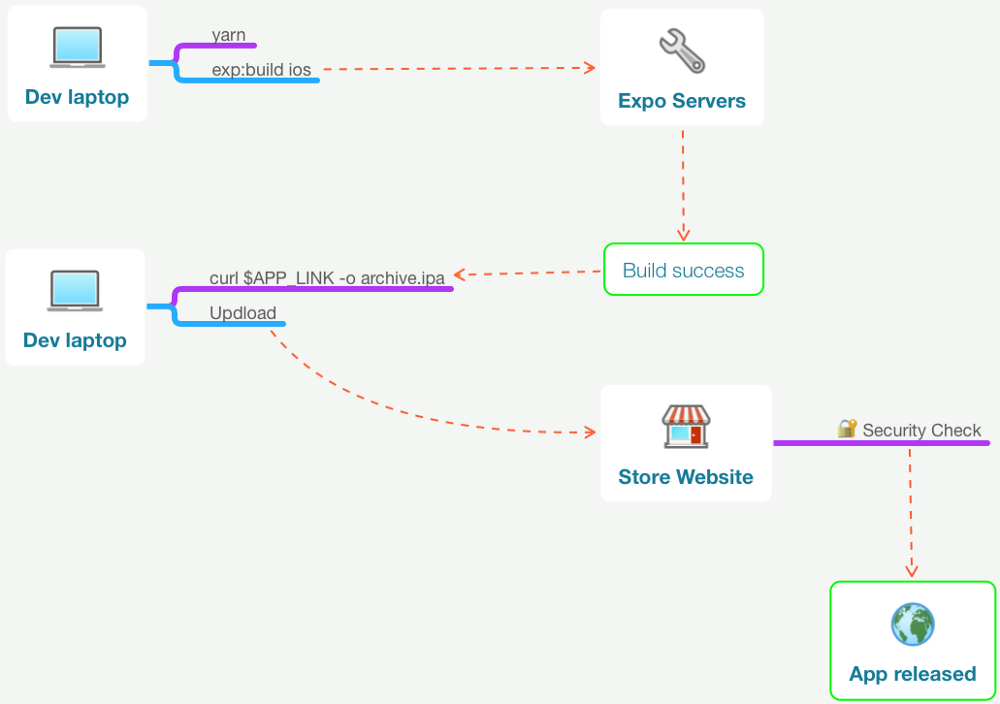

# Mais componentes

Já temos um componente funcional em nossa tela, mas vamos componentizar ainda mais.

Nosso primeiro passo é nomear corretamente o nosso componente inicial, daremos o nome de `ListaAnimais`, para isso, iremos renomear o arquivo `App.js` para `ListaAnimais.js` e a classe:

- `ListaAnimais.js`

```jsx
export default class ListaAnimais extends Component {
  // Código omitido
}
```

- `index.js`

```jsx
AppRegistry.registerComponent(appName, () => ListaAnimais);
```

Em seguida iremos decompor nosso componente, criando um componente específico para representar cada animal na listagem, criaremos o arquivo `Animal.js` dentro da pasta `components`:

- `Animal.js`

```jsx
import React, {Component} from 'react';
import {Dimensions, Image, StyleSheet, Text, View} from 'react-native';

const {width} = Dimensions.get('screen');

export default class Animal extends Component {
  render() {
    const animal = {};
    return (
      <View>
        <Text style={styles.nomeAnimal}>{animal.nome}</Text>
        <Image
          source={{
            uri: animal.urlImagem,
          }}
          style={styles.imagemAnimal}
        />
      </View>
    );
  }
}

const styles = StyleSheet.create({
  nomeAnimal: {fontSize: 16},
  imagemAnimal: {width, height: width},
});
```

Nosso próximo passo é utilizar este componente para compor a lista de animais:

- `ListaAnimais.js`

```jsx
import React, {Component} from 'react';
import {FlatList, View} from 'react-native';
import Animal from './Animal';

export default class ListaAnimais extends Component {
  render() {
    const animais = [
      {
        nome: 'Leão',
        urlImagem:
          'https://upload.wikimedia.org/wikipedia/commons/4/40/Just_one_lion.jpg',
      },
      {
        nome: 'Girafa',
        urlImagem:
          'https://upload.wikimedia.org/wikipedia/commons/9/97/Namibie_Etosha_Girafe_02.jpg',
      },
      {
        nome: 'Gato',
        urlImagem:
          'https://upload.wikimedia.org/wikipedia/commons/b/b2/WhiteCat.jpg',
      },
    ];

    return (
      <View>
        <FlatList
          data={animais}
          renderItem={({item}) => <Animal />}
          keyExtractor={item => item.nome}
        />
      </View>
    );
  }
}
```

Mas agora temos um problema, o array `animais` está no componente `ListaAnimais`, como podemos torná-lo disponível no componente `Animal`?

## Props

A maioria dos componentes pode ser personalizada quando eles são criados, com diferentes parâmetros. Esses parâmetros de criação são chamados de _props_.

As _props_ permitem criar um único componente que é usado em muitos lugares diferentes do aplicativo, com propriedades ligeiramente diferentes em cada lugar. Basta se referir a `this.props` em sua função de renderização.

- `ListaAnimais.js`

```jsx
export default class ListaAnimais extends Component {
  render() {
    // Código omitido
    return (
      <View>
        <FlatList
          data={animais}
          renderItem={({item}) => <Animal animal={item} />}
          keyExtractor={item => item.nome}
        />
      </View>
    );
  }
}
```

- `Animal.js`

```jsx
export default class Animal extends Component {
  render() {
    const {animal} = this.props;
    return (
      <View>
        <Text style={styles.nomeAnimal}>{animal.nome}</Text>
        <Image
          source={{
            uri: animal.urlImagem,
          }}
          style={styles.imagemAnimal}
        />
      </View>
    );
  }
}
```

## Um pouco de interatividade

Vamos permitir que o usuário possa "curtir" um animal da listagem, para isso, vamos adicionar uma imagem com o ícone de "like" a cada um dos animais.

Primeiramente, na raiz do projeto, vamos criar uma pasta chamada `assets`, dentro desta pasta vamos colocar o arquivo `like.png`.

Agora vamos colocar este elemento visual em tela.

- `Animal.js`

```jsx
export default class Animal extends Component {
  render() {
    const {animal} = this.props;
    return (
      <View>
        <Text style={styles.nomeAnimal}>{animal.nome}</Text>
        <Image
          source={{
            uri: animal.urlImagem,
          }}
          style={styles.imagemAnimal}
        />
        <View style={styles.likeContainer}>
          <Image
            style={styles.likeButton}
            source={require('../../assets/like.png')}
          />
        </View>
      </View>
    );
  }
}

const styles = StyleSheet.create({
  likeContainer: {
    justifyContent: 'center',
    alignItems: 'center',
    marginTop: 10,
    marginBottom: 15,
  },
  likeButton: {width: 35, height: 30},
  nomeAnimal: {fontSize: 16},
  imagemAnimal: {width, height: width},
});
```

Já colocamos o botão de curtir em tela mas se tentarmos clicar no mesmo, nada ocorre. Para conseguirmos isso, devemos utilizar um outro componente do React Native, o TouchableOpacity:

- `Animal.js`

```jsx
export default class Animal extends Component {
  render() {
    const {animal} = this.props;
    return (
      <View>
        <Text style={styles.nomeAnimal}>{animal.nome}</Text>
        <Image
          source={{
            uri: animal.urlImagem,
          }}
          style={styles.imagemAnimal}
        />
        <View style={styles.likeContainer}>
          <TouchableOpacity onPress={() => console.warn('Curtiu!')}>
            <Image
              style={styles.likeButton}
              source={require('../../assets/empty-star.png')}
            />
          </TouchableOpacity>
        </View>
      </View>
    );
  }
}
```

Quando clicamos no botão de like

xxxxxxxxxxxxxxxxxxxxxxxxxxxxxxxxxxxxxxxxxxxxxxxxxxxxxx

### Setando state

Existem dois tipos de dados que controlam um componente: _props_ e _state_. _props_ são definidas pelo componente pai e são fixas durante todo o tempo de vida de um componente. Para os dados que vão mudar, temos que usar o _state_.

Em geral, você deve inicializar o estado no construtor e, em seguida, chamar `setState` quando quiser alterá-lo.

Vamos fazer um simples contator de cliques em nossa aplicação:

```jsx
// App.js
// Código anterior omitido
// Novidade aqui!
import {Button, StyleSheet, View} from 'react-native';

export default class App extends React.Component {
  // Novidade aqui!
  constructor(props) {
    super(props);
    this.state = {clicks: 0};
  }

  // Novidade aqui!
  handleClick() {
    this.setState({
      clicks: this.state.clicks + 1,
    });
  }

  render() {
    return (
      <View style={styles.container}>
        {/* Novidade aqui! */}
        <Button
          title={`Clicou ${this.state.clicks} vezes`}
          onPress={this.handleClick.bind(this)}
        />
      </View>
    );
  }
}
// Código posterior omitido
```

Outra forma de fazer o bind:

```jsx
// App.js
// Código anterior omitido
export default class App extends React.Component {
  constructor(props) {
    super(props);
    this.state = {clicks: 0};

    // Novidade aqui!
    this.handleClick = this.handleClick.bind(this);
  }

  handleClick() {
    this.setState({
      clicks: this.state.clicks + 1,
    });
  }

  render() {
    return (
      <View style={styles.container}>
        {/* Novidade aqui! */}
        <Button
          title={`Clicou ${this.state.clicks} vezes`}
          onPress={this.handleClick}
        />
      </View>
    );
  }
}
// Código posterior omitido
```

E mais uma forma de fazer o bind:

```jsx
// App.js
// Código anterior omitido
export default class App extends React.Component {
  constructor(props) {
    super(props);
    this.state = {clicks: 0};
  }

  // Novidade aqui!
  handleClick = () => {
    this.setState({
      clicks: this.state.clicks + 1,
    });
  };

  render() {
    return (
      <View style={styles.container}>
        <Button
          title={`Clicou ${this.state.clicks} vezes`}
          onPress={this.handleClick}
        />
      </View>
    );
  }
}
// Código posterior omitido
```

setState também possui uma segunda forma onde é passada uma função como argumento:

```jsx
// App.js
// Código anterior omitido
export default class App extends React.Component {
  constructor(props) {
    super(props);
    this.state = {clicks: 0};
  }

  // Novidade aqui!
  handleClick = () => {
    this.setState(prevState => ({clicks: prevState.clicks + 1}));
  };

  render() {
    return (
      <View style={styles.container}>
        <Button
          title={`Clicou ${this.state.clicks} vezes`}
          onPress={this.handleClick}
        />
      </View>
    );
  }
}
// Código posterior omitido
```

### Ciclo de vida

<!-- https://code.likeagirl.io/understanding-react-component-life-cycle-49bf4b8674de -->

Cada componente React vem com vários métodos que permitem aos desenvolvedores atualizar o estado do aplicativo e refletir a alteração na interface do usuário. Existem três fases principais de um componente, incluindo mounting (montagem), updating (atualização) e unmounting (desmontagem).

#### Mounting

Esses métodos serão chamados quando uma instância de um componente React for criada e montada no DOM.

##### constuctor()

Esse método é chamado antes de um componente React ser montado. É essencial chamar `super(props)` antes de qualquer declaração no construtor. Isto ocorre pois nos permitirá chamar o construtor da classe pai e inicializar a si mesmo caso nossa classe estenda qualquer outra classe que tenha o próprio construtor.

O construtor é perfeito para inicializar o estado ou vincular os manipuladores de eventos à instância da classe. Por exemplo:

```jsx
constructor(props) {
  super(props);
  this.state = {
    count: 0,
    value: 'Hey There!',
  };
  this.handleClick = this.handleClick.bind(this);
};
```

O construtor não deve causar nenhum efeito colateral.

#### componentWillMount()

`componentWillMount` será chamado uma vez antes do componente ser montado e será executado antes da função de renderização.

#### componentDidMount()

Depois que um componente é montado, esse método é chamado. Este é o local certo para carregar qualquer dado do _endpoint_.

Chamar aqui `setState` irá disparar re-render, então use este método com cuidado.

### Updating

#### componentDidUpdate(prevProps, prevState, snapshot)

Este método será chamado após cada renderização ocorrer. Como esse método é chamado apenas uma vez após a atualização, é um local adequado para implementar quaisquer operações de efeitos colaterais.

### Unmounting

#### componentWillUnmount()

Quando um componente é desmontado ou destruído, este método será chamado. Este é um lugar para fazer alguma limpeza como:

- Invalidando temporizadores
- Cancelar qualquer pedido de rede
- Remover manipuladores de eventos
- Limpar todas as assinaturas


### JSX

<!-- https://reactjs.org/docs/introducing-jsx.html -->

A sintaxe de tags curiosa que estamos utilizando não é JavaScript nem HTML.

É chamado de JSX e é uma extensão de sintaxe para JavaScript. Recomenda-se usá-lo com o React para descrever como deve ser a interface do usuário. O JSX pode lembrá-lo de uma linguagem de marcação, mas ela vem com todo o poder do JavaScript.

O JSX produz React "elements".

#### Por que o JSX?

O React adota o fato de que a lógica de renderização é inerentemente associada a outra lógica da interface do usuário: como os eventos são tratados, como o estado muda com o tempo e como os dados são preparados para exibição.

Em vez de separar artificialmente as tecnologias, colocando marcação e lógica em arquivos separados, o React separa as preocupações com unidades fracamente acopladas chamadas “componentes” que contêm ambos.

O React não exige o uso de JSX, mas a maioria das pessoas considera útil como um auxílio visual ao trabalhar com a interface do usuário dentro do código JavaScript.

#### Incorporando Expressões no JSX

No exemplo abaixo, nós declaramos uma variável chamada _nome_ e a usamos dentro do JSX, colocando-a entre chaves:

```jsx
// App.js
// Código anterior omitido
export default class App extends React.Component {
  constructor(props) {
    super(props);
  }

  render() {
    const nome = 'José';

    return (
      <View style={styles.container}>
        <Text>Olá {nome}</Text>
      </View>
    );
  }
}
// Código posterior omitido
```

Você pode colocar qualquer expressão JavaScript válida dentro das chaves no JSX. Por exemplo, 2 + 2, usuario.nome ou formatMessage(message) são todas expressões JavaScript válidas.

No exemplo abaixo, incorporamos o resultado de chamar uma função JavaScript, formatMessage(message).

```jsx
// App.js
// Código anterior omitido
export default class App extends React.Component {
  constructor(props) {
    super(props);
  }

  formatMessage(message = '') {
    return message.toUpperCase();
  }

  render() {
    const nome = 'José';

    return (
      <View style={styles.container}>
        <Text>Olá {this.formatMessage(nome)}</Text>
      </View>
    );
  }
}
// Código posterior omitido
```

#### JSX é uma expressão também

Após a compilação, as expressões JSX se tornam chamadas de função JavaScript regulares e são avaliadas como objetos JavaScript.

Isso significa que você pode usar o JSX dentro de instruções if e for loops, atribuí-lo a variáveis, aceitá-lo como argumentos e retorná-lo de funções:

```jsx
// App.js
// Código anterior omitido
export default class App extends React.Component {
  constructor(props) {
    super(props);
  }

  formatMessage(message = '') {
    let el;
    if (message.length > 2) {
      el = <Text>{message.toUpperCase()}</Text>;
    } else {
      el = <Text>{message}</Text>;
    }
    return el;
  }

  render() {
    const nome = 'José';
    const saudacao = 'oi';

    return (
      <View style={styles.container}>
        {this.formatMessage(saudacao)}
        {this.formatMessage(nome)}
      </View>
    );
  }
}
// Código posterior omitido
```

#### Especificando Atributos com JSX

Você pode usar aspas para especificar literais de string como atributos:

```jsx
// App.js
// Código anterior omitido
export default class App extends React.Component {
  constructor(props) {
    super(props);
  }

  render() {
    return (
      <View style={styles.container}>
        <Mensagem texto="Olá José" />
      </View>
    );
  }
}
// Código posterior omitido
```

Você também pode usar chaves para incorporar uma expressão JavaScript em um atributo:

```jsx
// App.js
// Código anterior omitido
export default class App extends React.Component {
  constructor(props) {
    super(props);
  }

  render() {
    const minhaMsg = 'Olá José';
    return (
      <View style={styles.container}>
        <Mensagem texto={minhaMsg} />
      </View>
    );
  }
}
// Código posterior omitido
```

### Componentes de Função e Classe

Já vimos como criar componentes a partir de uma classe (a classe Mensagem), porém, há uma forma simplificada de criar componentes através de funções:

```jsx
// App.js
// Código anterior omitido
function MensagemSimples(props) {
  return <Text>Um componente de função: {props.texto}</Text>;
}

export default class App extends React.Component {
  constructor(props) {
    super(props);
  }

  render() {
    const minhaMsg = 'Olá José';
    return (
      <View style={styles.container}>
        <MensagemSimples texto={minhaMsg} />
      </View>
    );
  }
}
// Código posterior omitido
```

Essa função é um componente React válido porque aceita um único argumento de objeto "props" (que significa propriedades) com dados e retorna um elemento React. Chamamos esses componentes de "componentes de função" porque são literalmente funções JavaScript.

## Instalando Expo Client para desenvolvimento e debug da aplicação

O Expo Client permite que você teste o código diretamente em um dispositivo físico, para isso, ele deve ser instalado através da
[loja de aplicativos](https://play.google.com/store/apps/details?id=host.exp.exponent&referrer=www).

Uma grande vantagem do Expo Client é que podemos compilar o código em um computador Windows/Linux e executar em um iPhone.

## Analizando Expo Client & Dicas

Ao balançar o dispositivo, podemos acessar o menu do desenvolvedor do Expo Cli, onde podemos:

- Reload: Recarregar a aplicação
- Debug JS Remotely: Debugar a aplicação remotamente (Chrome remote debugging)
- Habilitar/Desabilitar o Live Reload
- Habilitar o Hot Reloading
- Ativar o "inspector"
- Exibir o monitor de performance
- Iniciar/Parar o profiler de JavaScript

## Buildando um APK ou IPA via Expo CLi

A construção do binário, em sua versão final que será entregue para a loja de aplicativos é realizada no servidor do Expo:



<!--
https://docs.expo.io/versions/latest/distribution/building-standalone-apps

https://docs.expo.io/versions/v24.0.0/expokit/detach
-->

Deve ser impostado o seguinte commando:

```bash
PS C:\Users\usuario\projects\HelloWorld> expo build:android
```
