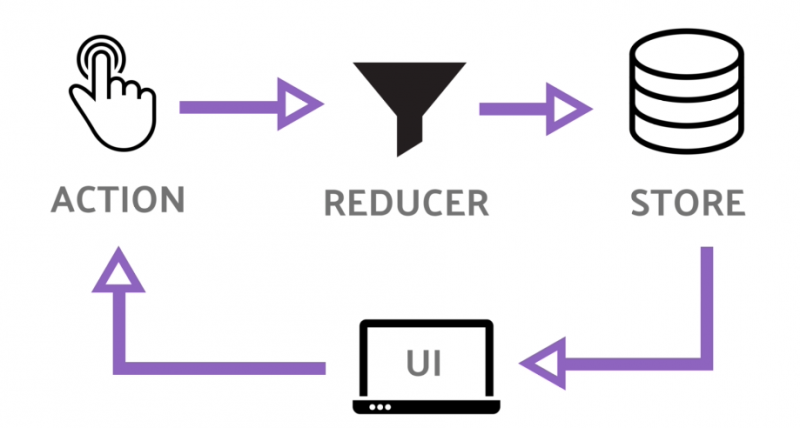

# Redux

Quando uma aplicação torna-se muito completa, o gerenciamento de estado pode se tornar algo extremamente problemático, é para resolver este problema que foi criada uma biblioteca chamada Redux.

O Redux é um contêiner de estado previsível para aplicativos JavaScript.

Ele ajuda escrever aplicativos que se comportam de maneira consistente, executados em diferentes ambientes (cliente, servidor e nativo) e são fáceis de testar. Além disso, proporciona uma ótima experiência de desenvolvedor, como edição de código ao vivo combinada com um depurador de viagem no tempo.

O Redux pode ser utilizado junto com o React ou com qualquer outra biblioteca de visualizações. E é uma biblioteca pequena (2kB, incluindo dependências).

## Conceitos centrais



Imagine que o estado de um aplicativo é descrito como um objeto simples. Por exemplo, o estado de um aplicativo todo pode ter esta aparência:

```jsx
{
  todos: [{
    text: 'Eat food',
    completed: true
  }, {
    text: 'Exercise',
    completed: false
  }],
  visibilityFilter: 'SHOW_COMPLETED'
}
```

Este objeto é como um "modelo", exceto que não há "setters". Isso acontece para que diferentes partes do código não alterem o estado arbitrariamente, causando bugs difíceis de reproduzir.

Para mudar algo no estado, você precisa despachar uma ação. Uma ação é um objeto JavaScript simples que descreve o que aconteceu. Aqui estão algumas ações de exemplo:

```jsx
{ type: 'ADD_TODO', text: 'Go to swimming pool' }
{ type: 'TOGGLE_TODO', index: 1 }
{ type: 'SET_VISIBILITY_FILTER', filter: 'SHOW_ALL' }
```

Obrigando que todas as alterações são descritas como uma ação nos permite ter uma compreensão clara do que está acontecendo no aplicativo. Se algo mudou, sabemos porque mudou. Ações são como rastros do que aconteceu. Finalmente, para amarrar estados e ações juntos, escrevemos uma função chamada "reducer". Novamente, nada de mágico - é apenas uma função que toma o estado e a ação como argumentos e retorna o próximo estado do aplicativo. Seria difícil escrever uma função desse tipo para um aplicativo grande, por isso escrevemos funções menores gerenciando partes do estado:

```jsx
function visibilityFilter(state = 'SHOW_ALL', action) {
  if (action.type === 'SET_VISIBILITY_FILTER') {
    return action.filter
  } else {
    return state
  }
}
​
function todos(state = [], action) {
  switch (action.type) {
    case 'ADD_TODO':
      return state.concat([{ text: action.text, completed: false }])
    case 'TOGGLE_TODO':
      return state.map(
        (todo, index) =>
          action.index === index
            ? { text: todo.text, completed: !todo.completed }
            : todo
      )
    default:
      return state
  }
}
```

E escrevemos outro redutor que gerencia o estado completo do nosso aplicativo chamando esses dois redutores para as chaves de estado correspondentes:

```jsx
function todoApp(state = {}, action) {
  return {
    todos: todos(state.todos, action),
    visibilityFilter: visibilityFilter(state.visibilityFilter, action),
  };
}
```

Esta é basicamente a ideia do Redux. Observe que não usamos nenhuma API do Redux. Ele vem com alguns utilitários para facilitar esse padrão, mas a idéia principal é que se descreva como o estado é atualizado ao longo do tempo em resposta a objetos de ação, e 90% do código que você escreve é ​​simplesmente JavaScript, sem uso do Redux em si, suas APIs ou qualquer "mágica".

## Os três princípios

### Única fonte de verdade

"O estado de todo o aplicativo é armazenado em uma árvore de objetos em um único local de armazenamento."

Isso facilita a criação de aplicativos universais, já que o estado do servidor pode ser serializado e implantado no cliente sem nenhum esforço extra de codificação. Uma única árvore de estado também facilita a depuração ou inspeção de um aplicativo; Ele também permite que você persista o estado do seu aplicativo em desenvolvimento, para um ciclo de desenvolvimento mais rápido. Algumas funcionalidades que têm sido tradicionalmente difíceis de implementar - Desfazer/Refazer, por exemplo - podem subitamente tornar-se triviais de implementar, se todo o seu estado estiver armazenado em uma única árvore.

```jsx
{
  visibilityFilter: 'SHOW_ALL',
  todos: [
    {
      text: 'Consider using Redux',
      completed: true,
    },
    {
      text: 'Keep all state in a single tree',
      completed: false
    }
  ]
}
```

### Estado é somente leitura

"A única maneira de mudar o estado é emitir uma ação, um objeto descrevendo o que aconteceu."

Isso garante que nem as exibições nem os callbacks da rede jamais serão gravados diretamente no estado. Em vez disso, eles expressam a intenção de transformar o estado. Como todas as mudanças são centralizadas e acontecem uma a uma em uma ordem estrita, não há condições corrida a serem observadas. Como as ações são apenas objetos simples, elas podem ser registradas, serializadas, armazenadas e, posteriormente, reproduzidas para fins de depuração ou teste.

```jsx
store.dispatch({
  type: 'COMPLETE_TODO',
  index: 1
})
​
store.dispatch({
  type: 'SET_VISIBILITY_FILTER',
  filter: 'SHOW_COMPLETED'
})
```

### As alterações são feitas com funções puras

"Para especificar como a árvore de estados é transformada por ações, você escreve redutores puros."

Redutores são apenas funções puras que tomam o estado anterior e uma ação, e retornam o próximo estado. Lembre-se de retornar novos objetos de estado, em vez de alterar o estado anterior. Você pode começar com um único redutor e, à medida que seu aplicativo cresce, divida-o em redutores menores que gerenciam partes específicas da árvore de estados. Como os redutores são apenas funções, você pode controlar a ordem na qual eles são chamados, passar dados adicionais ou até mesmo fazer reduções reutilizáveis ​​para tarefas comuns, como paginação.

```jsx
function visibilityFilter(state = 'SHOW_ALL', action) {
  switch (action.type) {
    case 'SET_VISIBILITY_FILTER':
      return action.filter
    default:
      return state
  }
}
​
function todos(state = [], action) {
  switch (action.type) {
    case 'ADD_TODO':
      return [
        ...state,
        {
          text: action.text,
          completed: false
        }
      ]
    case 'COMPLETE_TODO':
      return state.map((todo, index) => {
        if (index === action.index) {
          return Object.assign({}, todo, {
            completed: true
          })
        }
        return todo
      })
    default:
      return state
  }
}
​
import { combineReducers, createStore } from 'redux'
const reducer = combineReducers({ visibilityFilter, todos })
const store = createStore(reducer)
```

## Passando o controle de estado para o Redux

Para iniciarmos com a utilização do Redux, primeiro, precisamos instalar as bibliotecas necessárias:

```bash
> npm install --save redux react-redux
```

Agora vamos criar nossos primeiros _reducers_:

- `src\reducers\animais.js`

```jsx
import {animais} from '../../data.json';

const initialState = animais;

export default function animaisReducer(state = initialState, action) {
  switch (action.type) {
    default:
      return state;
  }
}
```

- `src\reducers\usuarioLogado.js`

```jsx
import {usuarioLogado} from '../../data.json';

const initialState = usuarioLogado;

export default function usuarioLogadoReducer(state = initialState, action) {
  switch (action.type) {
    default:
      return state;
  }
}
```

Agora criaremos um arquivo `index.js` na pasta `reducers` que terá a função de combinar os vários _reducers_ que criamos:

- `src\reducers\index.js`

```jsx
import {combineReducers} from 'redux';
import animaisReducer from './animais';
import usuarioLogadoReducer from './usuarioLogado';

const rootReducer = combineReducers({
  animais: animaisReducer,
  usuarioLogado: usuarioLogadoReducer,
});

export default rootReducer;
```

Em seguira, criaremos um arquivo JavaScript que tem a função criar uma _store_ a partir dos _reducers_:

- `src\configureStore.js`

```jsx
import {createStore} from 'redux';
import rootReducer from './reducers';

export default function configureStore() {
  let store = createStore(rootReducer);
  return store;
}
```

Um passo adicional que faremos é a divisão do componente `ListaAnimais` em dois, teremos um componente de ordem superior que será responsável pelas configurações gerais da aplicação, esta divisão será útil quando começarmos a realizar navegações em nossa aplicação.

- `src\App.js`

```jsx
import {Container, Content, Header, Title} from 'native-base';
import React, {Component} from 'react';
import {StyleSheet} from 'react-native';
import {Provider} from 'react-redux';
import ListaAnimais from './components/ListaAnimais';
import configureStore from './configureStore';

const store = configureStore();

export default class App extends Component {
  render() {
    return (
      <Provider store={store}>
        <Container>
          <Header style={styles.header}>
            <Title>Controle de Animais</Title>
          </Header>
          <Content padder>
            <ListaAnimais />
          </Content>
        </Container>
      </Provider>
    );
  }
}

const styles = StyleSheet.create({
  header: {height: 30},
  separator: {
    height: 1,
    backgroundColor: '#CED0CE',
    marginBottom: 10,
  },
});
```

O último passo é a atualização de `ListaAnimais` para que utilize o Redux:

- `ListaAnimais`

```jsx
import React, {Component} from 'react';
import {FlatList} from 'react-native';
import {connect} from 'react-redux';
import Animal from './Animal';

class ListaAnimais extends Component {
  favoritar = animal => {
    const {usuarioLogado} = this.state;

    let novoAnimal = {...animal};

    novoAnimal.favoritoUsuarios = [
      ...novoAnimal.favoritoUsuarios,
      usuarioLogado,
    ];

    this.atualizarAnimal(novoAnimal);
  };

  desfavoritar = animal => {
    const {usuarioLogado} = this.state;

    let novoAnimal = {...animal};

    novoAnimal.favoritoUsuarios = novoAnimal.favoritoUsuarios.filter(
      usuario => usuario !== usuarioLogado,
    );

    this.atualizarAnimal(novoAnimal);
  };

  atualizarAnimal = novoAnimal => {
    const novosAnimais = this.state.animais.map(a =>
      a._id === novoAnimal._id ? novoAnimal : a,
    );

    this.setState({animais: novosAnimais});
  };

  render() {
    const {animais, usuarioLogado} = this.props;
    return (
      <FlatList
        data={animais}
        renderItem={({item}) => (
          <Animal
            animal={item}
            usuarioLogado={usuarioLogado}
            favoritarCallback={this.favoritar}
            desfavoritarCallback={this.desfavoritar}
          />
        )}
        keyExtractor={item => item.nome}
      />
    );
  }
}

const mapStateToProps = state => {
  return {
    animais: state.animais,
    usuarioLogado: state.usuarioLogado,
  };
};

const mapDispatchToProps = {};

export default connect(
  mapStateToProps,
  mapDispatchToProps,
)(ListaAnimais);
```

No entanto, agora se você tentar favoritar um animal ocorrerá um erro. Temos que ajustar as funcionalidades de nossa aplicação para que utilizem a lógica do Redux.

Em primeiro lugar, criaremos um arquivo chamado `constants.js` que conterá as contantes relativas às ações:

- `src\constants.js`

```jsx
const FAVORITAR = 'FAVORITAR';
const DESFAVORITAR = 'DESFAVORITAR';

export {FAVORITAR, DESFAVORITAR};
```

Agora, vamos criar um arquivo `actions.js` que irá criar as ações do Redux a partir de funções simples:

- `src\actions.js`

```jsx
import {FAVORITAR, DESFAVORITAR} from './constants';

export function favoritar(animal, usuario) {
  return {
    type: FAVORITAR,
    data: {
      animal,
      usuario,
    },
  };
}

export function desfavoritar(animal, usuario) {
  return {
    type: DESFAVORITAR,
    data: {
      animal,
      usuario,
    },
  };
}
```

Um outro passo é atualizar o reducer de animais, para suportar estas novas ações:

- `src\reducers\animais.js`

```jsx
import {animais} from '../../data.json';
import {FAVORITAR, DESFAVORITAR} from '../constants.js';

const initialState = animais;

function atualizaAnimal(listaAnimais, animal) {
  return listaAnimais.map(a => (a._id === animal._id ? animal : a));
}

export default function animaisReducer(state = initialState, action) {
  switch (action.type) {
    case FAVORITAR: {
      const {animal, usuario} = action.data;
      const novoAnimal = {...animal};
      novoAnimal.favoritoUsuarios = [...novoAnimal.favoritoUsuarios, usuario];
      return atualizaAnimal(state, novoAnimal);
    }

    case DESFAVORITAR: {
      const {animal, usuario} = action.data;
      const novoAnimal = {...animal};
      novoAnimal.favoritoUsuarios = novoAnimal.favoritoUsuarios.filter(
        u => u !== usuario,
      );
      return atualizaAnimal(state, novoAnimal);
    }

    default:
      return state;
  }
}
```

Simplificaremos agora o componente de `ListaAnimais` pois não será mais necessário passar tantas props para o componente `Animal`:

- `ListaAnimais`

```jsx
import React, {Component} from 'react';
import {FlatList} from 'react-native';
import {connect} from 'react-redux';
import Animal from './Animal';

class ListaAnimais extends Component {
  render() {
    const {animais} = this.props;
    return (
      <FlatList
        data={animais}
        renderItem={({item}) => <Animal animal={item} />}
        keyExtractor={item => item.nome}
      />
    );
  }
}

const mapStateToProps = state => {
  return {
    animais: state.animais,
    usuarioLogado: state.usuarioLogado,
  };
};

const mapDispatchToProps = {};

export default connect(
  mapStateToProps,
  mapDispatchToProps,
)(ListaAnimais);
```

O componente `Animal` será todo refatorado para disparar as ações do Redux:

- `Animal.js`

```jsx
import {Body, Card, CardItem} from 'native-base';
import React, {Component} from 'react';
import {Dimensions, Image, StyleSheet, Text} from 'react-native';
import {connect} from 'react-redux';
import BotaoFavoritar from './BotaoFavoritar';
import {favoritar, desfavoritar} from '../actions';
import {bindActionCreators} from 'redux';

const {width} = Dimensions.get('screen');

class Animal extends Component {
  isFavoritado(animal, usuarioLogado) {
    return !!animal.favoritoUsuarios.find(usuario => usuario === usuarioLogado);
  }

  render() {
    const {animal} = this.props;

    return (
      <Card>
        <CardItem header bordered>
          <Text style={styles.nomeAnimal}>{animal.nome}</Text>
        </CardItem>
        <CardItem bordered>
          <Body style={styles.imageContainer}>
            <Image
              source={{
                uri: animal.urlImagem,
              }}
              style={styles.imagemAnimal}
            />
          </Body>
        </CardItem>
        <CardItem footer bordered>
          <BotaoFavoritar
            favoritado={this.isFavoritado(animal, this.props.usuarioLogado)}
            favoritarCallback={() =>
              this.props.favoritar(animal, this.props.usuarioLogado)
            }
            desfavoritarCallback={() =>
              this.props.desfavoritar(animal, this.props.usuarioLogado)
            }
          />
          <Text>
            Este animal
            {animal.favoritoUsuarios.length > 0
              ? ` já foi favoritado por ${animal.favoritoUsuarios.length} usuário(s)`
              : ' ainda não foi favoritado'}
          </Text>
        </CardItem>
      </Card>
    );
  }
}

const mapStateToProps = state => {
  return {
    animais: state.animais,
    usuarioLogado: state.usuarioLogado,
  };
};

const mapDispatchToProps = dispatch =>
  bindActionCreators({favoritar, desfavoritar}, dispatch);

export default connect(
  mapStateToProps,
  mapDispatchToProps,
)(Animal);

const styles = StyleSheet.create({
  nomeAnimal: {fontSize: 18, fontWeight: 'bold'},
  imagemAnimal: {width: width * 0.7, height: width * 0.7},
  imageContainer: {
    flex: 1,
    justifyContent: 'center',
    alignItems: 'center',
  },
});
```
