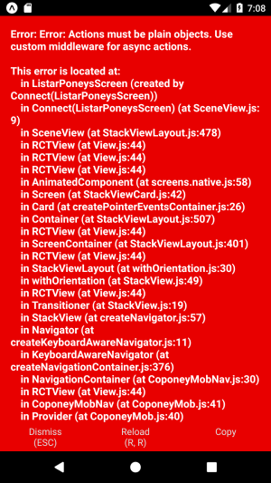

# Conectando às APIs

Chegou a hora de começarmos a consumir as APIs de backend. Já temos um servidor levantado com as seguintes funcionalidades:

- Listar Animais - GET - https://cozooapi.herokuapp.com/v1/animais
- Cadastrar Animal - POST - https://cozooapi.herokuapp.com/v1/animais
- Detalhar Animal - GET - https://cozooapi.herokuapp.com/v1/animais/{id}
- Atualizar Animal - PUT - https://cozooapi.herokuapp.com/v1/animais/{id}
- Excluir Animal - DELETE - https://cozooapi.herokuapp.com/v1/animais/{id}

Caso queira dar uma olhada no código fonte deste serviço, ele pode ser acessado em https://github.com/tiagolpadua/cozooapi.

O código de acionamento de nossa API ficará isolado em uma pasta `api` dentro de `src`, mas para realizar os requests usaremos a biblioteca _axios_ (https://github.com/axios/axios), vamos instalá-la em nosso projeto:

```bash
> npm install axios
```

Agora criaremos o arquivo que faz as chamadas para as APIs:

- `src/api/index.js`

```jsx
import axios from 'axios';

const api = axios.create({
  baseURL: 'https://cozooapi.herokuapp.com/v1/',
});

export function listaAnimais() {
  return api.get('/animais');
}

export function excluirAnimal(id) {
  return api.delete(`/animais/${id}`);
}

export function incluirAnimal(animal) {
  return api.post('/animais', animal);
}

export function atualizarAnimal(animal) {
  return api.put(`/animais/${animal._id}`, animal);
}
```

Devemos também ajustar o arquivo de constantes para incluir a nova constante `CARREGAR_ANIMAIS`:

- `src/constants.js`

```jsx
const FAVORITAR = 'FAVORITAR';
const DESFAVORITAR = 'DESFAVORITAR';
const CARREGAR_ANIMAIS = 'CARREGAR_ANIMAIS';

export {FAVORITAR, DESFAVORITAR, CARREGAR_ANIMAIS};
```

O próximo passo é chamar esta API a partir do arquivo que define as ações:

- `src/actions.js`

```jsx
import {carregarAnimaisAPI} from './api';
import {CARREGAR_ANIMAIS, DESFAVORITAR, FAVORITAR} from './constants';

export function carregarAnimais() {
  carregarAnimaisAPI()
    .then(res => ({
      type: CARREGAR_ANIMAIS,
      data: res.data,
    }))
    .catch(error => {
      console.warn(error.message);
    });
}

// ...
```

Agora, vamos ajustar nosso reducer de animais para aceitar a ação `CARREGAR_ANIMAIS`:

- `src/reducers/animais.js`

```jsx
import {animais} from '../../data.json';
import {FAVORITAR, DESFAVORITAR, CARREGAR_ANIMAIS} from '../constants.js';

const initialState = animais;

function atualizaAnimal(listaAnimais, animal) {
  return listaAnimais.map(a => (a._id === animal._id ? animal : a));
}

export default function animaisReducer(state = initialState, action) {
  switch (action.type) {
    case CARREGAR_ANIMAIS:
      return action.data;

    // ...
  }
}
```

O último passo é fazer com que, no momento de carregamento da tela de listagem, haja a solicitação de carregamento da lista de animais na aplicação:

- `src/components/ListaAnimais.js`

```jsx
import React, {Component} from 'react';
import {FlatList} from 'react-native';
import {connect} from 'react-redux';
import Animal from './Animal';
import {carregarAnimais} from '../actions';
import {bindActionCreators} from 'redux';

class ListaAnimais extends Component {
  // Novidade aqui
  componentDidMount() {
    this.props.carregarAnimais();
  }

  render() {
    const {animais} = this.props;
    return (
      <FlatList
        data={animais}
        renderItem={({item}) => <Animal animal={item} />}
        keyExtractor={item => item.nome}
      />
    );
  }
}

const mapStateToProps = state => {
  return {
    animais: state.animais,
    usuarioLogado: s  tate.usuarioLogado,
  };
};

// Novidade aqui
const mapDispatchToProps = dispatch =>
  bindActionCreators({carregarAnimais}, dispatch);

export default connect(
  mapStateToProps,
  mapDispatchToProps,
)(ListaAnimais);
```

Mas se tentarmos executar nossa app vamos receber um erro:



Ou seja, uma ação deve retornar um "objeto plano".

## Redux Thunk

Com uma store Redux básica e simples, você só pode fazer atualizações síncronas simples despachando uma ação. O middleware amplia as habilidades da store e permite escrever uma lógica assíncrona que interage com a store.

Os thunks são o middleware recomendado para a lógica básica de efeitos colaterais do Redux, incluindo lógica síncrona complexa que precisa de acesso ao armazenamento e lógica assíncrona simples como solicitações AJAX. (https://github.com/reduxjs/redux-thunk)

O middleware Redux Thunk permite escrever criadores de ação que retornam uma função em vez de uma ação. O thunk pode ser usado para atrasar o envio de uma ação ou para enviar somente se uma determinada condição for atendida. A função interna recebe os métodos de armazenamento expedidos e `getState` como parâmetros.

O primeiro passo é instalá-lo:

```bash
> npm install --save redux-thunk
```

Agora, vamos ajustar nossa função em `configureStore` para utilizar o _redux-thunk_:

- `configureStore.js`

```jsx
import {applyMiddleware, createStore} from 'redux';
import thunk from 'redux-thunk';
import rootReducer from './reducers';

export default function configureStore() {
  let store = createStore(rootReducer, applyMiddleware(thunk));
  return store;
}
```

Nossa action também deve ser ajustada para utilizar uma função `dispatch`:

- `actions.js`

```jsx
export function carregarAnimais() {
  return dispatch => {
    carregarAnimaisAPI()
      .then(res => {
        dispatch({
          type: CARREGAR_ANIMAIS,
          data: res.data,
        });
      })
      .catch(error => {
        console.warn(error.message);
      });
  };
}
```

Após a realização destes passos, nossa primeira chamada à API deve estar funcionando corretamente.
